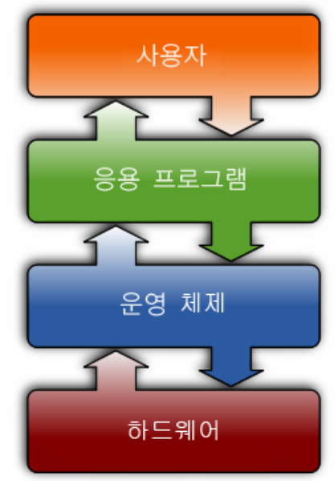
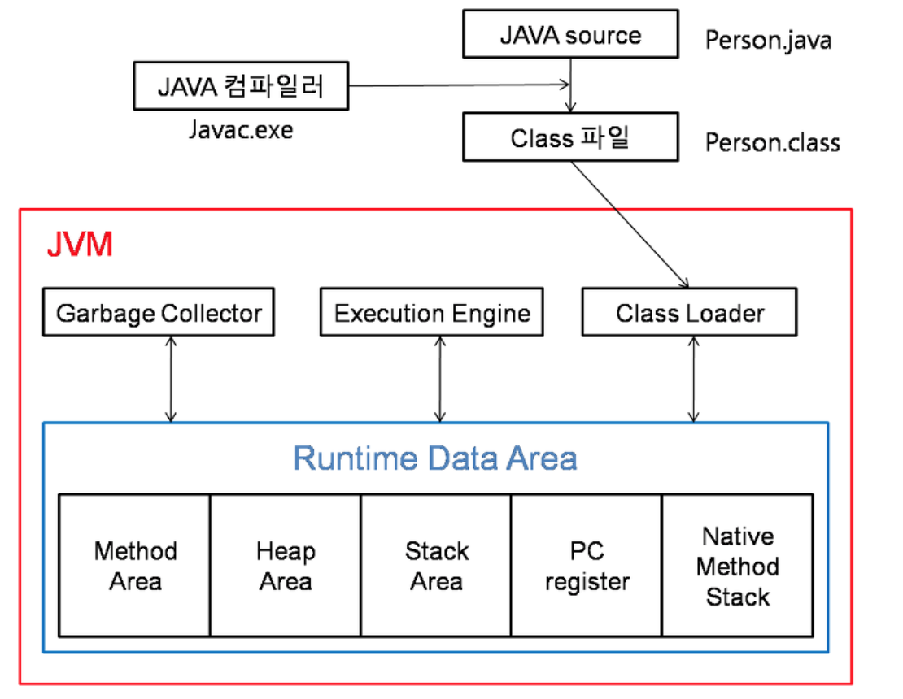
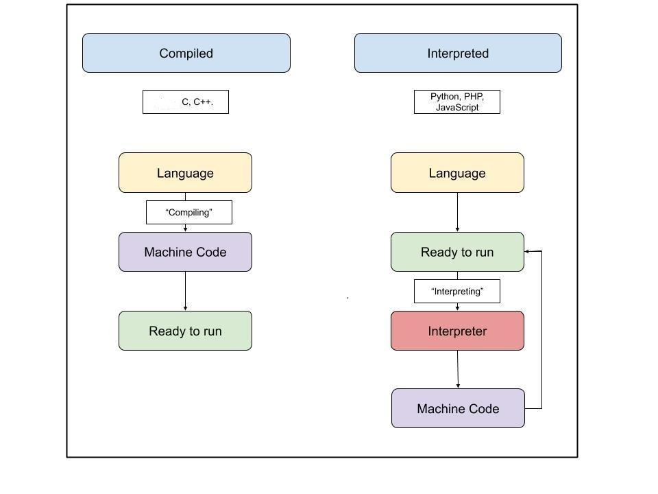

# Week 1 과제
24.09.16 ~ 24.09.20
## JVM이란 무엇인가
JYM(Java Virture Machine), 스택* 기반의 자바 가상 머신   
Java는 기계어가 아닌 bytecode로 컴파일 하여 OS*(운영체제)에 종속받지 않는다. 이러한 bytecode를 JVM이 읽어들인 다음 해당 OS에 맞게 변환하여 전달하기 때문에 OS와 독립적으로 Java를 실행 할 수 있게 하는 가상 컴퓨터라고 할 수 있다. 하지만 OS에 맞는 JVM을 다운받아야 하기 때문에 JVM은 OS에 종속됐다.    

*스택 : 프로그램이 실행되기 위해서는 메모리에 로드(load)되어야 한다. OS에서 할당받는 메모리 공간은 코드(code), 데이터(data), 스택(stack), 힙(heap) 영역으로 나뉘는데 이 중 스택 영역은 함수의 호출과 관계되는 지역 변수와 매개변수가 저장되는 영역이다. 스택영역은 함수의 호툴과 함께 할당되며, 함수의 호출이 완료되면 소멸한다.   

*OS : Operating System, 컴퓨터 시스템의 각종 하드웨어적인 자원과 소프트웨어적인 자원을 효울적으로 운영 관리함으로써 사용자가 시스템을 이용하는데 편리함을 제공하는 시스템 소프트웨어를 말한다.    

*JDK : 자바 개발 환경, 자바 어플리케이션을 개발하기 위해 필요한 도구를 제공한다. 자바 언어를 바이트 코드로 컴파일 해주는 자바 컴파일러(javac), 자바 클래스 파일을 해석해주는 역 어셈블리어(javap) 등이 있다.

*JRE : 자바 실행 환경으로 JVM, 자바 클래스 라이브러리, 기타 자바 어플리케이션 실행에 필요한 파일들을 포함한다.
## JVM 구성 요소
  
#### Class Loader(클래스 로더)
Class Loader, JVM 내로 클래스 파일(*.class)을 로드하고, 링크를 통해 배치하는 작업을 수행하는 모듈이다.
런 타임시 동적으로 클래스를 로드하고 jar* 파일 내 저장된 클래스들을 JVM 위에 탑재한다.
즉, 클래스를 처음으로 참조할 때, 해당 클래스를 로드하고 링크한는 역할을 한다.   

*JAR : Java Archive, 여러개의 자바 클래스 파일과, 클래스들이 이용하는 관련 리소스(텍스트, 그림 등) 및 메타데이터를 하나의 파일로 모아서 자바 플랫폼에 응용 소프트웨어나 라이브러리를 배포하기 위한 소프트웨어 패키지 파일 포맷이다.

#### 실행 엔진
Execution Engine, 클래스를 실행시키는 역할이다. 클래스 로더가 JVM내의 런타임 데이터 영역에 바이트 코드를 배치시키고, 이것은 실행 엔진에 의해 실행된다. 자바 바이트 코드(*.class)는 기계가 바로 수행할 수 있는 언어보다는 비교적 인간이 보기 편한 형태로 기술된 것이다. 그래서 실행 엔진은 이와 같은 바이트 코드를 실제로 JVM 내부에서 기계가 실행할 수 있는 형태로 변경한다.

 *인터프리터 : 실행 엔진은 자바 바이트 코드를 명령어 단위로 읽어서 실행한다. 하지만 한 줄씩 수행하기 때문에 느리다는 단점이 있다.

 *JIT(Just-In-Time) : 인터프리터 방식으로 실행하다가 적절한 시점에 바이트 코드 전체를 컴파일하여 기계어로 변경하고, 이후에는 해당 더 이상 인터프리팅 하지 않고 기계어로 직접 실행하는 방식이다.

 

#### 가비지 콜렉터
Garbage collector, 더이상 사용되지 않는 인스턴스를 찾아 메모리에서 삭제함.

#### Runtime Data Area (런타임 데이터 영역)

Runtime Data Area, 프로그램을 수행하기 위해 OS에서 할당받은 메모리 공간

## 컴파일 하는 방법
개발자가 자바 소스코드(.java)를 작성하면 자바 컴파일러(Java Compiler)가 자바 소스파일을 컴파일한다. 이때 나오는 파일은 자바 바이트 코드(.class)파일로 아직 컴퓨터가 읽을 수 없는 자바 가상 머신이 이해할 수 있는 코드이다. 바이트 코드의 각 명령어는 1바이트 크기의 Opcode와 추가 피연산자로 이루어져 있다. 컴파일된 바이트 코드를 JVM의 클래스로더(Class Loader)에게 전달힌다. 클래스 로더는 동적로딩(Dynamic Loading)을 통해 필요한 클래스들을 로딩 및 링크하여 런타임 데이터 영역(Runtime Data area), 즉 JVM의 메모리에 올린다.

## 실행하는 방법
1. 프로그램이 실행되면 JVM은 OS로부터 이 프로그램이 필요로 하는 메모리를 할당받는다. JVM은 이 메모리를 용도에 따라 여러 영역으로 나누어 관리한다.
2. 자바 컴파일러(javac)가 자바 소스코드(.java)(개발자가 작성한 코드)를 읽어들여 자바 바이트코드(.class)로 변환시킨다.
3. Class Loader를 통해 class파일들을 JVM으로 로딩한다.
4. 로딩된 class파일들은 Execution engine을 통해 기계어로 해석된다.
5. 해석된 바이트코드는 Runtime Data Areas 에 배치되어 실질적인 수행이 이루어지게 된다. 이러한 실행과정 속에서 JVM은 필요에 따라 Thread* Synchronization*과 GC*같은 관리작업을 수행한다.   
   

*Runtime Data Areas : 프로그램을 수행하기 위해 OS에서 할당받은 메모리 공간

*Thread : 스레드(Thread)란 한번에 여러 작업을 동시에 하는 것을 의미한다.

*Thread Synchronization : 여러가지 작업에서 공통적으로 쓰이는 데이터에 대하여 한 번에 여러 스레드가 접근한다면, 프로그램이 예상과는 다른 방향으로 꼬여버릴 수 있다. 이러한 점을 예방하기 위해 공유데이터에 대하여 스레드들의 동시 접근을 방지하는 기능이다. 

*GC : Garbage Collection, JVM 상에서 더 이상 사용되지 않는 데이터가 할당되어있는 메모리를 해제시켜주는 장치이다. GC 가 주로 동작하는 대상은 Heap 영역 내의 객체 중에서 참조되지 않은 데이터이다.

## 바이트코드란 무엇인가
Java 소스코드(프로그램 언어,*.java)를 CPU가 인식할 수 있게 기계어로 컴파일 해야 하는데 OS가 인식하는 기계어가 아닌 JVM이 인식 할 수 있는 Java bytecode(*.class)로 변환된다.그럼으로 OS에서 바로 실행되지 않고 JVM에서 실행되고 JVM이 bytecode를 해석해서 OS에서 실행될 수 있다. OS가 없이 독립적으로 실행될 수 있다.

## JIT 컴파일러란 무엇이며 어떻게 동작하는지
먼저 JIT 컴파일(just-in-time compilation) 또는 동적 번역(dynamic translation)은 프로그램을 실제 실행하는 시점에 기계어로 번역하는 컴파일 기법이다.    

    자바는 컴파일러와 인터프리터를 사용한다. 컴파일러와 인터프리터는 모두 high-level language를 machine language로 번역하는데 컴파일러는 소스 코드(high-level language로 작성) 전체를 링커 등을 통해 한번에 번역하여 목적 파일(기계어로 작성)로 만들어 메모리상에 적재한다. 인터프리터는 소스 코드를 한 행씩 중간 코드로 번역 후 실행한다.  
     

    자바 코드를 실행하기 위해서는 자바 컴파일러가 자바 소스코드를 JVM을 위한 기계어로 변환하고 JVM의 실행 엔진 내에 있는 자바 인터프리터를 통해 바이트코드를 특정 환경의 기계어로 번역하고 실행한다. 따라서 자바는 코드를 실행하기 위해서는 바이트코드로 컴파일하는 과정과 바이트코드를 인터프리트하는 과정을 거쳐야 하기 때문에 컴파일 과정만 필요한 다른 프로그래밍 언어보다 느리다. 
 
 JIT 컴파일러는 실행 시점에서는 인터프리터와 같이 기계어 코드를 생성하면서 해당 코드가 컴파일 대상이 되면 컴파일하고 그 코드를 캐싱*한다. JIT 컴파일은 코드가 실행되는 과정에 실시간으로 일어나며(그래서 Just-In-Time이다), 전체 코드의 필요한 부분만 변환한다. 기계어로 변환된 코드는 캐시*에 저장되기 때문에 재사용 시 컴파일을 다시 할 필요가 없다.

 *캐시 : 데이터나 값을 미리 복사해 놓는 임시 장소

 *캐싱 : 캐시를 사용하는 것으로, 병목 현상*을 완화하기 위해 CPU와 메인 메모리(RAM) 사이에 크기는 작지만 속도가 빠른 캐시 메모리를 두고, 향후 재사용할 가능성이 클 것으로 예상되는 데이터의 복사본을 저장해 둔 CPU가 요청하는 데이터를 바로바로 전달할 수 있도록 한다.

 *병목현상 : 시스템 내에서 전체적인 처리 속도를 떨어뜨리게 되는 특정한 부분을 가리키는 용어

## JDK와 JRE의 차이
*JDK : 자바 개발 환경, 자바 어플리케이션을 개발하기 위해 필요한 도구를 제공한다. 자바 언어를 바이트 코드로 컴파일 해주는 자바 컴파일러(javac), 자바 클래스 파일을 해석해주는 역 어셈블리어(javap) 등이 있다.

*JRE : 자바 실행 환경으로 JVM, 자바 클래스 라이브러리, 기타 자바 어플리케이션 실행에 필요한 파일들을 포함한다.

## 출처 및 참고 문헌
[JVM이란](https://backendcode.tistory.com/161)   
[Java Virtual Machine](https://asfirstalways.tistory.com/158)   
[[JAVA] JVM이란? 개념 및 구조 (JDK, JRE, JIT, 가비지 콜렉터...)](https://doozi0316.tistory.com/entry/1%EC%A3%BC%EC%B0%A8-JVM%EC%9D%80-%EB%AC%B4%EC%97%87%EC%9D%B4%EB%A9%B0-%EC%9E%90%EB%B0%94-%EC%BD%94%EB%93%9C%EB%8A%94-%EC%96%B4%EB%96%BB%EA%B2%8C-%EC%8B%A4%ED%96%89%ED%95%98%EB%8A%94-%EA%B2%83%EC%9D%B8%EA%B0%80)      
[JVM이란? #2 JVM 구성 요소와 역할 정리](https://velog.io/@dmchoi224/JVM%EC%9D%B4%EB%9E%80-2-JVM-%EA%B5%AC%EC%84%B1-%EC%9A%94%EC%86%8C%EC%99%80-%EC%97%AD%ED%95%A0-%EC%A0%95%EB%A6%AC)     
[1-4. [자료구조이론] 스택(Stack)](https://velog.io/@hyhy9501/3-1.-%EC%8A%A4%ED%83%9DStack)     
[스택(Stack)과 힙(Heap) 차이점
](https://junghyun100.github.io/%ED%9E%99-%EC%8A%A4%ED%83%9D%EC%B0%A8%EC%9D%B4%EC%A0%90/)   
[IT 관련용어[OS]운영체제란 무엇인가?](https://m.blog.naver.com/pst8627/221663921157?view=img_4)   
[[Java]JIT 컴파일러란?](https://hyeinisfree.tistory.com/26)
[[Java] 컴파일 과정](https://gyoogle.dev/blog/computer-language/Java/%EC%BB%B4%ED%8C%8C%EC%9D%BC%20%EA%B3%BC%EC%A0%95.html)