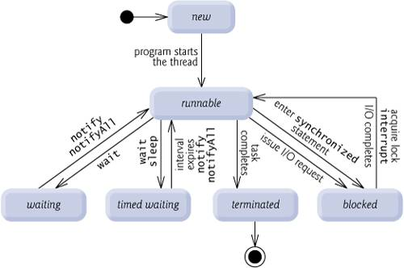
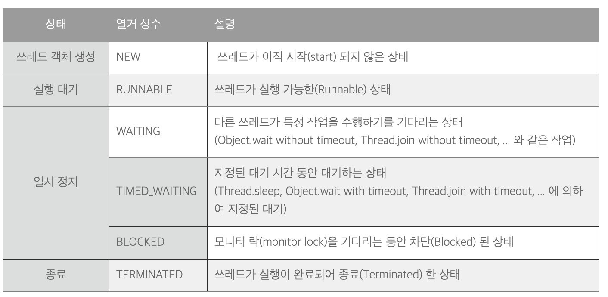
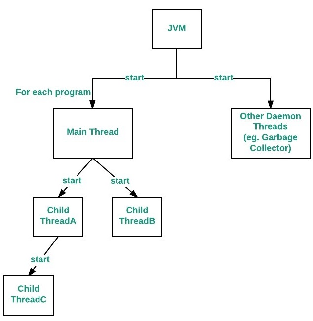

# Week 10 스터디
## 스터디 기간(과제 제출 기간)
24.11.19 ~ 24.12.03

## 스터디 주제
### README 스터디 내용 정리 세부 주제
- Thread Class와 Runnable Interface
Thread는 Runnable 인터페이스를 구현하고 있기 때문에 start() 메서드를 통해 run() 메서드를 오버라이드해서 사용할 수 있습니다.


```
#방법1
public class MyThread extends Thread {
	@Override
	public void run() {
		System.out.println("MyThread is running");
	}
}
public static void main(String[] args) {
	Thread myThread = new MyThread();
	myThread.start(); // MyThread is running
}
```

Thread를 인스턴스화 할 때 생성자의 매개변수로 Runnable 인스턴스를 주입합니다.
```
#방법2
public class MyRunnableImpl implements Runnable {
	@Override
	public void run() {
		System.out.println("MyRunnableImpl is running");
	}
}
public static void main(String[] args) {
	Runnable myRunnable = new MyRunnableImpl();
	Thread myThread= new Thread(myRunnable);
	myThread.start(); // MyRunnableImpl is running
}
```

- Thread의 상태


Runnable 인터페이스를 구현하여 쓰레드를 구성한 경우는 Thread.currentThread().getState() 메서드를 이용하여 쓰레드의 상태를 확인할 수 있다고 합니다. Thread 클래스를 상속받아 구성한 경우는 전자의 방법도 가능하고, 부모의 getState() 메서드를 바로 이용해도 된다고 합니다. 

- Thread의 우선 순위
모든 Thread는 priority(우선순위)를 가지며, priority가 높을 수록 우선 순위가 낮은 Thread 보다 더 많은 리소스를 사용하기 위해 시도하며, 상대적으로 낮은 우선순위를 가진 스레드는 CPU 자원을 적게 얻으려고 시도합니다.

priority의 기본값은 부모 Thread의 priority이며, 1부터 10까지의 priority를 가질 수 있습니다. main Thread의 경우 기본적으로 5의 priority를 가지고 있어 main Thread에서 priority를 설정하지 않고 Thread를 생성한다면 기본적으로 5의 priority를 가집니다. priority는 setPriority() 메서드를 통해 설정할 수 있습니다.

만약 priority가 1이하 이거나 10을 초과한다면 IllegalArgumentException이 발생합니다. 아래의 테스트 코드는 최소 priority인 1 이하이고, 최대 priority인 10을 초과하여 IllegalArgumentException이 발생되어 테스트 코드를 통과합니다.
- Main Thread

메인 스레드의 특성 
메인 스레드는 다른 자식 스레드가 생성됩니다.
다양한 종료 작업을 수행하기 때문에 대체로 마지막으로 실행 종료되는 스레드여야 합니다.

메인 스레드는 프로그램의 실행과 동시에 생성됩니다. 메인 스레드를 제어하기 위해선 이것의 참조를 얻어야 합니다. 호출된 스레드의 참조를 반환하는Thread.currentThread() 명령어를 통해 참조를 얻을 수 있습니다. 


- 동기화
스레드 동기화는 멀티스레드 환경에서 여러 스레드가 하나의 공유자원에 동시에 접근하지 못하도록 막는것을 말합니다. 공유데이터가 사용되어 동기화가 필요한 부분을 임계영역(critical section)이라고 부르며, 자바에서는 이 임계영역에 synchronized 키워드를 사용하여 여러 스레드가 동시에 접근하는 것을 금지함으로써 동기화를 할 수 있습니다. 
```
# 방법1
# 메소드 이름 앞에 synchronized 키워드를 사용하면 해당 메소드 전체를 임계영역으로 설정하실수 있습니다. 

synchronized void increase() {
	count++;
	System.out.println(count);
}
# 방법2
# 동기화를 많이 사용하게 되면 효율이 떨어지게 되므로 꼭 필요한 부분에만 블럭을 지정하여 임계영역으로 설정하실 수 있습니다. 예제와 같이 synchronized(this)로 지정하게 되면 참조변수(this) 객체의 lock을 사용하게 됩니다. 
void increase() {
	synchronized(this) {
		count++;
	}
	System.out.println(count);
}

```

- 데드락
```
// Main class
public class GFG {
 
  // Main driver method
  public static void main(String[] args) {
 
    // Try block to check for exceptions
    try {
 
      // Print statement
      System.out.println("Entering into Deadlock");
 
      // Joining the current thread
      Thread.currentThread().join();
 
      // This statement will never execute
      System.out.println("This statement will never execute");
    }
 
    // Catch block to handle the exceptions
    catch (InterruptedException e) {
 
      // Display the exception along with line number
      // using printStackTrace() method
      e.printStackTrace();
    }
  }
}
```

Thread.currentThread().join() 명령어는 자식 스레드가 종료될때까지 대기시키는 명령어입니다. 위 코드에서 메인 스레드에서 이를 실행시켰는데, 메인 스레드의 자식 스레드가 없는 상황이므로, 메인 스레드 본인이 종료될 때까지 대기를 하게 됩니다. 이것은 아무 의미 없는 교착상태(deadlock)를 유발하게 됩니다.


참고자료
1. https://mangkyu.tistory.com/258
2. https://jongwoon.tistory.com/14
3. https://velog.io/@paki1019/Java-%EB%A9%94%EC%9D%B8-%EC%8A%A4%EB%A0%88%EB%93%9CMain-thread
4. https://kadosholy.tistory.com/123
5. https://velog.io/@jhl221123/%EC%9E%90%EB%B0%94-%EB%A9%80%ED%8B%B0-%EC%8A%A4%EB%A0%88%EB%93%9C%EC%9D%98-%EB%AC%B8%EC%A0%9C%EC%99%80-%ED%95%B4%EB%B2%95-%EC%8A%A4%EB%A0%88%EB%93%9C-%EB%8F%99%EA%B8%B0%ED%99%94
### 실습 내용
**WARNING: GPT 안돼요!!**

아래 예시와 같이 Thread가 여러개 겹치는 상황에 대해서 어떻게 동작하는지 예상해 본 다음 실험해봅시다.

```java
public class ThreadExample {
    public static void main(String[] args) throws Exception {
        Thread thread = new MyThread();

        // thread 스레드 실행
        thread.start();

        // main 스레드 동작
        for (int i=0; i<10; i++) {
            System.out.println("Main");
        }
    }
}
```

## 과제 완료 인원
|이름|닉네임|확인✔|
|---|------|----|
|김민우|[M1nu0x0](https://github.com/M1nu0x0)|✔|
|김서윤|[TomnJelly](https://github.com/TomnJelly)||
|배현진|[hyunjin809](https://github.com/hyunjin809)||

## 10주차 발표자
**[발표자](https://github.com/발표자)**
