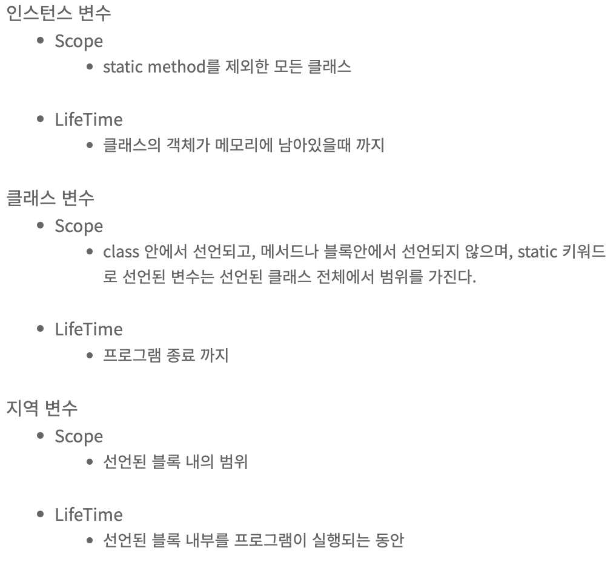
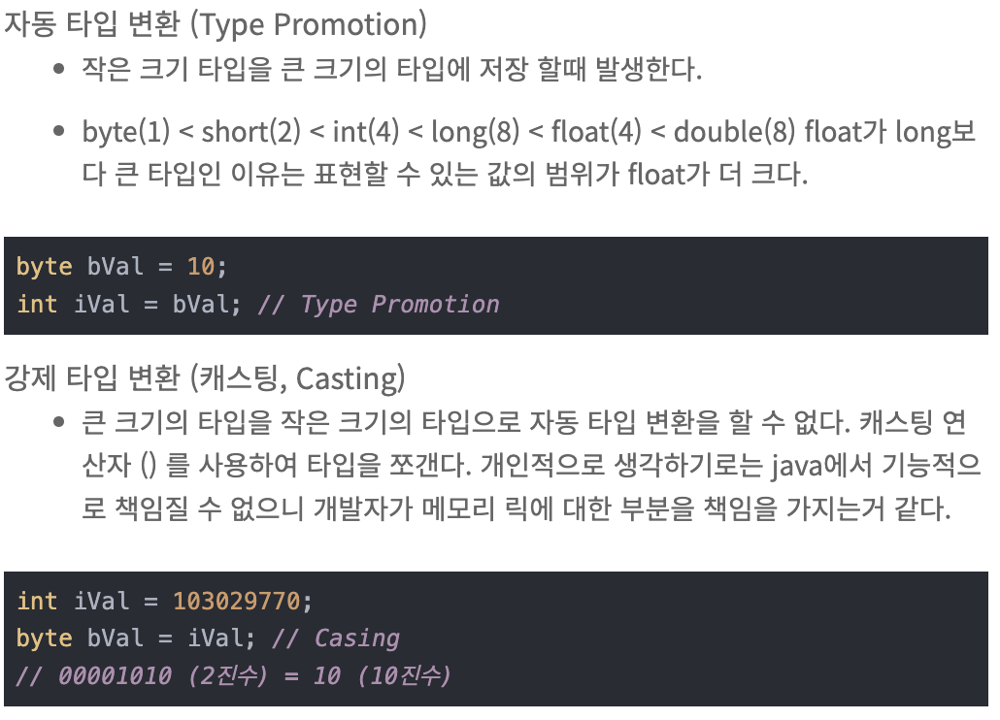

# Week 2 스터디
## 스터디 기간(과제 제출 기간)
24.09.16 ~ 24.09.24

## 스터디 주제
### README 스터디 내용 정리 세부 주제
  ## Primitive Type 종류와 값의 범위, 기본 값
Primitive Type은 
int, long, double, float, booolean, byte, short, char 총 8가지가 있다. 
자바에서 기본 자료형은 반드시 사용하기 전에 선언 되어야 하며, 자료형의 길이는 운영체제에 독립적이다.


##  Primitive Type vs Reference Type
1. Null 포함 가능 여부
원시 타입은 null을 담을 수 없지만, 참조 타입은 가능하다. 

2. 제너릭 타입에서 사용 가능 여부
원시 타입은 제너릭 타입에서 사용할 수 없지만, 참조 타입은 가능하다.

## Literal
: 리터럴이란 프로그램에서 직접 표현한 값으로, 소스 코드의 고정된 값을 대표하는 용어이다. 
종류로는 정수, 실수, 문자, 논리, 문자열 리터럴이 있다.

+ 정수 리터럴 / 10진수, 8잔수, 16진수, 2진수, int 형, long 형
+ 실수 리터럴 / float, double 형
+ 문자 리터럴 / 단일 인용부호('')로 문자를 표현한다.
+ 문자열 리터럴 / 문자열은 기본타입이 아니며, 더블 쿼터("")로 문자열을 표현한다.
  
## 변수 선언 및 초기화 (+ 변수 네이밍 규칙)
변수를 선언할 때에는 저장하고자 하는 데이터 타입과 함께 변수 이름을 작성한다.

    int a;  // 변수 선언
    a = 5;  // 변수 초기화
    int a = 5; // 변수와 초기화 한번에

자바의 변수 명명 규칙
  * 카멜표기법(camelCase) : 단어의 첫글자는 소문자, 두번째 단어부터 첫 글자를 대문자로 표기
  * 이때 사용 가능한 문자는 영문자(대소문자 구분), 숫자, _, $를 사용할 수 있다. 
  * 변수 이름은 사용 목적에 맞게 이름을 짓는다.
  * 자바의 예약어는 식별자로 사용할 수 없다. ex : if, else, for, class
  * 상수는 모두 대분자로 작성하며 여러 단어는 밑줄로 구분한다.

## 변수의 Scope와 Lifetime
변수의 Scope(범위)란 해당 변수를 사용 가능한 범위를 의미한다.
변수의 LifeTime(수명)은 메모리에서 변수가 언제 삭제되느냐를 의미한다.


## Type 변환 / Casting, Type Promotion
타입 변환이란 데이터 탕비을 다른 데이터 타입으로 변환하는 것을 말한다.
Java에서는 자동 타입 변환(Promotion), 강제 타입 변환 (캐스팅, Casting) 으로 자동(묵시적) 타입 변환과 강제(명시적) 타입 변환을 진행한다.


## 1차, 2차 배열 선언
* 1차원 배열 선언

        int[] array;
        int []array;
        int array[];
* 2차원 배열 선언

        int[][] array;
        int [][]array;
        int[] array[];

## 타입추론, `var`.
타입 추론이란 개발자가 변수의 타입을 명시적으로 선언하지 않아도 컴파일러가 알아서 변수의 타입이 저장된 리터럴의 값으로 추론하는 것이다.
  * var는 초기화 값이 있는 지역변수로만 선언이 가능하다.
  * var는 컴파일시 알아서 타입이 선언되는 구조로, 어떠한 키워드가 아니다.
  * var는 타입 추론에서 타입을 결정하므로 var로 선언된 변수는 타입이 중간에 변경되지 않는다.


참고 자료
1. https://velog.io/@wkdwoo/Primitive-type%EC%9B%90%EC%8B%9C%ED%83%80%EC%9E%85-vs.-Reference-type%EC%B0%B8%EC%A1%B0%ED%83%80%EC%9E%85
2. https://devpad.tistory.com/57
3. https://mine-it-record.tistory.com/100
4. https://ittrue.tistory.com/99
5. https://dev-jj.tistory.com/entry/Java-%EB%8D%B0%EC%9D%B4%ED%84%B0-%ED%83%80%EC%9E%85-%EB%A6%AC%ED%84%B0%EB%9F%B4%EC%9D%B4%EB%9E%80-%EB%B3%80%EC%88%98%EC%9D%98-Scope%EB%B2%94%EC%9C%84-LifeTime%EC%88%98%EB%AA%85

### 실습 내용
**WARNING: GPT 안돼요!!**

사용자로부터 입력받고, 출력하는 내용을 다음 `예시 출력`에 맞춰 작성해봅시다.

> 공부를 위해선 검색이 필수적입니다. 잘 찾아보고 해결해봅시다. 영어로 검색하는 연습도 해보시면 좋습니다. 혹은 공식 docs를 보는 연습도..

중괄호의 의미는 사용자 입력입니다. 따라서 `M1nu0x0`를 입력하라는 의미를 `{M1nu0x0}`로 적은 것 입니다.
```
Enter your name: {M1nu0x0}
Hello, M1nu0x0!
Enter your age: {22}
You are 22 years old.
```
> Tip! `M1nu0x0`는 *String*이며, `22`는 *int*다.

## 과제 완료 인원
|이름|닉네임|확인✔|
|---|------|----|
|김민우|[M1nu0x0](https://github.com/M1nu0x0)|✔|
|김서윤|[TomnJelly](https://github.com/TomnJelly)||
|배현진|[hyunjin809](https://github.com/hyunjin809)|✔|

## 2주차 발표자
**배현진 [hyunjin809](https://github.com/hyunjin809)**
