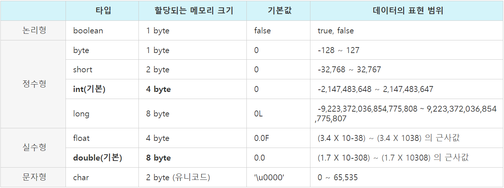
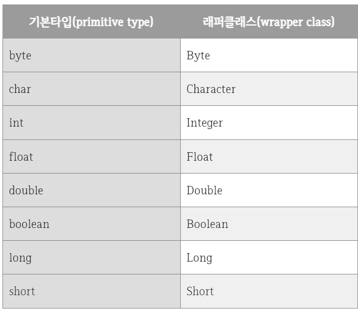
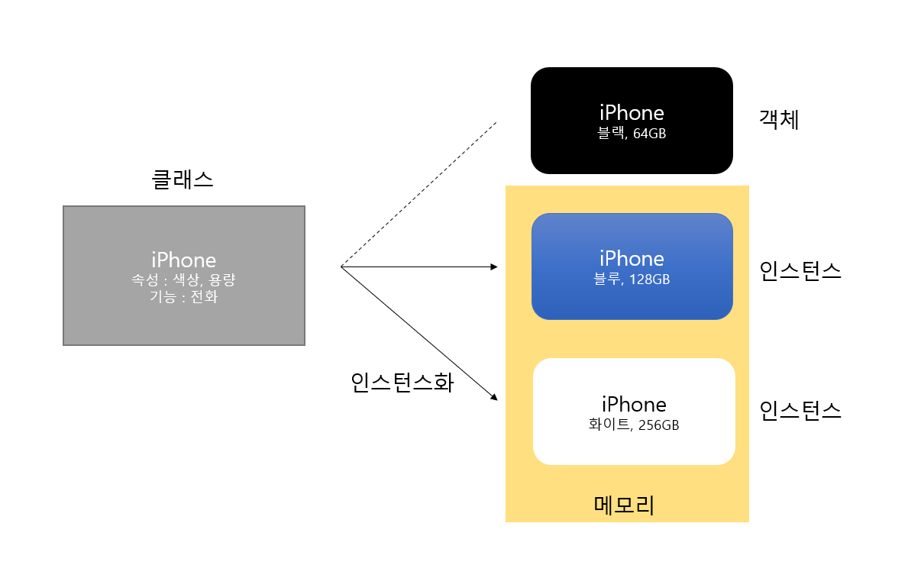
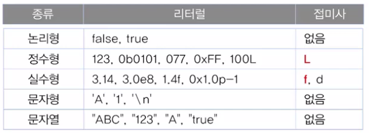
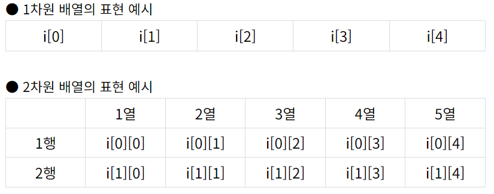
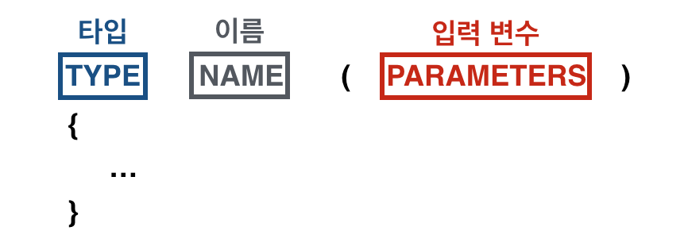

# Week 2 스터디

## Primitive Type 종류와 값의 범위, 기본 값
 Primitive Type : 자바의 기본형 타입으로서 정수, 실수, 문자, 논리 리터럴같이 실제 값을 직접 저장하는 타입을 말한다. 
 
 int, long, double, float, boolean, byte, short, char 총 8개의 타입들이 있고 기본값이 존재하기 때문에 Null 개념이 없으므로 Null을 넣고 싶다면 래퍼 클래스*를 활용하면 된다. 
 
 Java에서 기본 자료형은 반드시 사용하기 전에 선언(Declared) 되어야하며, 자료형의 길이는 운영체제에 독립적이며 변하지 않는다. 
 
 Primitive Type은 스택(Stack) 메모리에 저장된다.   
 
 

*레퍼 클래스 : 기본 자료타입(primitive type)을 객체로 다루기 위해서 사용하는 클래스들   

*박싱 : 기본타입의 데이터 -> 래퍼 클래스의 인스턴스로 변환하는 과정   

*언박싱 : 래퍼 클래스의 인스턴스에 저장된 값 -> 기본 타입의 데이터로 꺼내는 과정

    // 박싱
    // Integer 래퍼 클래스 num 에 21 의 값을 저장
    Integer num = new Integet(21);

    // 언박싱
    // 래퍼 클래스 num 의 값을 꺼내 가져온다.
    int n = num.intValue();

## Primitive Type vs Reference Type
Reference Type : 참조형 타입, Reference Type은 Primitive Type을 제외한 모든 타입들(문자열, 배열, 열거, 클래스, 인터페이스/java.lang.Object* 클래스를 상속*하는 모든 클래스들)을 말한다.

Reference Type은 Primitive Type과 달리 빈 객체를 의미하는 Null 개념이 존재한다. Reference Type은 값이 저장되어 있는 곳의 주소값을 저장하는 공간으로, 힙(Heap) 메모리에 저장된다. 이후 Garbage Collector가 돌면서 메모리를 해제한다.

힙 메모리에 생성된 인스턴스*는 메소드*나 각종 인터페이스에서 접근하기 위해 JVM의 Stack 영역에 존재하는 에 참조값을 가지고 있어 이를 통해 인스턴스를 핸들링한다.

문법상으로 에러가 없지만, 실행시 에러가 나는 런타임 에러가 발생한다. 예를 들어, 객체나 배열을 Null 값으로 받으면 NullPointException 에러가 발생하므로 그에 대한 널처리를 하는 등의 조치가 필요하다.   

*Objects : 모든 클래스의 조상 클래스로 가장 최상위 클래스이다. Object는 어떤 클래스가 됐든 간에 모든 클래스를 상속하기 때문에 Object의 멤버는 모든 클래스의 멤버가 된다. 부모가 없는 클래스는 자동적으로 Object 클래스를 상속받는다.

*객체 : 넓은 의미로 객체는 실세계에 존재하거나 생각할 수 있는 것으로 프로그래밍에서는 속성과 기능을 가지는 프로그램 단위를 의미한다.

*클래스 : 멤버 변수와 메서드를 가지는 객체를 만들기 위한 확장이 가능한 코드 양식

*인스턴스 : 클래스를 바탕으로 실체화되어 메모리에 할당된 실체   

*메서드 : 클래스(Class)의 내부에 존재하는 영역으로, 특정 기능을 하는 코드를 묶어서 나타내는 것이다. 즉, 특정 기능을 수행하기 위한 코드들의 집합체이다.

    public static void main(String[] args) {
    
    }

*상속 : 부모 클래스(상위 클래스)와 자식 클래스(하위 클래스)가 있으며, 자식 클래스는 부모 클래스를 선택해서, 그 부모의 멤버를 상속받아 그대로 쓸 수 있게 된다. 상속을 하는 이유는 이미 마련되어 있던 클래스를 재사용해서 만들 수 있기 때문에 효율적이고, 개발 시간을 줄여주게 된다.

## Literal
상수와 리터럴 둘 다, 변하지 않는 값(데이터)를 의미한다. 이 둘의 차이점은 상수는 변하지 않는 변수를 의미하는데 리터럴은 변수에 넣는 변하지 않는 데이터를 의미한다. 
 
즉,상수에 넣는 데이터는 숫자가 올 수 도 있지만,클래스나 구조체 같이 기본형에서 파생된 객체나 유도형*같은 데이터를 넣을 수 있다. 또한 참조변수(Reference type)를 상수로 지정할 때, 참조변수가 상수지 그 주소가 가리키는 데이터들까지 상수는 아니다. Java에서 상수를 쓸 때 는 final 제어자를 쓴다.
 
리터럴은 데이터 그 자체를 뜻 한다. 변수에 넣는 변하지 않는 데이터를 의미하는 것이다. 예를 들어 final int a = 1;이라고 할 때 a는 상수가 되고 리터럴은 1이다. 즉, 1과 같이 변하지 않는 데이터(boolean, char, double, long, int, etc...)를 리터럴(literal)이라고 부른다. 그리고 인스턴스(클래스데이터)는 동적으로 사용되기 때문에 리터럴이 될 수 없다. 하지만 String, Color같은 불변 클래스(immutable class)는 한번 생성하면 객체 안의 데이터가 변하지 않고 새로운 객체를 만들어주기 때문에 "abc"와 같은 문자열을 '객체 리터럴' 짧게는 '리터럴'이라고 표현한다.

리터럴의 값은 종류에 따라 정수 리터럴, 실수 리터럴, 문자 리터럴, 논리 리터럴로 구분되며, 정해진 표기법대로 작성해야 된다
 
정수 리터럴 (byte, char, short, int, long) : 소수점이 없는 정수 리터럴은 10진수로 간주한다.0b,0B로 시작되는 리터럴은 2진수로 간주한다. 0으로 시작되는 리터럴은 8진수로 간주한다. 0x(0X)로 시작하고 A,B,C,D,E,F로 구성된 리터럴은 16진수로 간주한다.

실수 리터럴 (float, double) : 소수점이 있는 리터럴은 10진수로 간주한다. float타입의 리터럴에 접미사 "f"또는 "F"를 붙이고, double 타입의 리터럴에는 접미사 "d" 또는 "D"를 붙인다. 접미사가 없으면 double로 간주한다
E(e)는 10의 제곱을 나타내는 기호이다. "p"나 "P" 기호는 2의 제곱을 의미한다. 싱글 쿼테이션(’)로 묶은 텍스트는 하나의 문자로 간주한다. 

역슬래쉬 (\)가 붙은 문자 리터럴은 이스케이프(escape) 문자라고 한다.문자 리터럴 (char) 또는 ('')같이 작은 따옴표로 문자 하나를 감싸는 것도 '문자 리터럴 '이다.문자 리터럴은 반드시 '' 안에 하나의 문자가 있어야 한다.

문자열 리터럴 (String) : 더블 쿼테이션(”) 으로 묶은 텍스트는 문자열 리터럴로 간주한다. "" 안에 아무런 문자도 넣지 않는 것이 가능하며, 이를 빈 문자열이라고 한다.

논리 리터럴 (boolean) : true, false로 구성.   

*유도형 데이터타입 : 기본 타입으로부터 유도되어 생성된 타입

# 변수 선언 및 초기화 (+ 변수 네이밍 규칙)
변수는 값을 저장할 수 있는 메모리 공간에 사람이 식별할 수 이름을 붙여 데이터를 저장하는 공간이다. 메모리 공간의 위치를 가리키는 주소가 0xa1b2c3… 등의 형태로 존재하는데, 이러한 주소를 사람이 사용하기에는 식별하기가 매우 어렵기 때문이다.

변수를 선언할 때에는 저장하고자 하는 데이터 타입과 함께 변수 이름을 작성해주어야 한다.    
ex : int a;

선언된 변수에 대입 연산자(=)을 사용해서 값을 할당할 수 있다.   
ex : int a = 5;
a와 같이 변수 선언 이후 처음으로 값을 할당하는 것을 초기화라고 한다. 초기화 이후 값을 다시 변경할 수도 있으며, 이를 변수 재할당이라 한다.   
ex : int a = 5; // 변수 a 초기화
     int a = 10; // 변수 a 재할당

자바에서 일반적으로 많이 쓰이는 명명 규칙은 카멜 표기법이다. 단어의 첫 번째 글자는 소문자, 두 번째 단어부터 첫 글자를 대문자로 표기하는 방법이다. 또한 변수명에는 영문자(대소문자 구분), 숫자, _, $를 사용할 수 있다. 하지만 숫자로 시작하거나 자바에서 사용중인 예약어는 변수명으로 사용할 수 없다. 그리고 변수명은 사람이 알아볼 수 있도록 사용목적에 알맞게 짖는 것이 중요하다. 

## 변수의 Scope와 Lifetime
변수의 스코프(영역)란 변수가 접근할 수 있는 유효 범위를 말한다. 일반적인 규칙은 변수가 선언된 블록내에서만 변수에 접근할 수 있다. 블록은 { }을 말하는데, Java에서 Class와 Method가 블록을 가진다. 변수의 LifeTime(수명)은 메모리에서 변수가 언제 삭제되느냐를 의미한다. 인스턴스 변수*, 클래스 변수*, 지역 변수*에 따라 scope와 LifeTime은 달라진다. 

    인스턴스 변수    
    Scope : static method를 제외한 모든 클래스   
    LifeTime : 클래스의 객체가 메모리에 남아있을때 까지

    클래스 변수   
    Scope : class 안에서 선언되고, 메서드나 블록안에서 선언되지 않으며, static 키워드로 선언된 변수는 선언된 클래스 전체에서 범위를 가진다.   
    LifeTime : 프로그램 종료 까지   

    지역 변수   
    Scope : 선언된 블록 내의 범위    
    LifeTime : 선언된 블록 내부를 프로그램이 실행되는 동안   

*인스턴스 변수 : 인스턴스 변수는 인스턴스가 생성될 때 생성된다. 각각의 인스턴스마다 고유의 값을 가져야할 때는 인스턴스 변수로 선언한다.

*클래스 변수 : 클래스 변수는 인스턴스 변수에 static만 붙여주면 된다. 인스턴스 변수는 각각 고유한 값을 가지지만 클래스 변수는 모든 인스턴스가 공통된 값을 공유하게 된다. 한 클래스의 모든 인스턴스들이 공통적인 값을 가져야할 때 클래스 변수로 선언한다. 클래스가 로딩될 때 생성되어 종료될 때까지 유지되며 public을 붙이면 같은 프로그램 내에서 어디서든 접근할 수 있는 전역 변수가 된다.

*지역변수 : 메서드 내에서 선언되며 메서드 내에서만 사용할 수 있는 변수다. 메서드가 실행될 때 메모리를 할당 받으며 메서드가 끝나면 소멸되어 사용할 수 없게 된다.

    public class test { 
	    int iv; // 인스턴스 변수 static int 
        cv; // 클래스 변수 
        void method() { 
	        int lv; // 지역 변수 
        } 
    }

## Type 변환 / Casting, Type Promotion
자바에서 데이터 타입을 변환하는 기본적인 방법은 타입 프로모션(Type Promotion)과 타입 캐스팅(Type Casting)이다.   

타입 프로모션은 자바에서 자동으로 이루어지는 데이터 타입 변환 과정이다. 이 과정에서 데이터 손실이 발생하지 않으며, 작은 데이터 타입의 값을 더 큰 데이터 타입으로 변환할 때 발생한다. 예를 들어, int 타입의 변수를 long 타입의 변수에 할당할 때 자동으로 타입 프로모션이 일어난다. 이는 데이터 손실을 방지하고, 연산의 정확성을 보장하기 위함이다. 타입 프로모션의 원리는 자바의 데이터 타입 계층 구조에 기반한다. byte(1) < short(2) < int(4) < long(8) < float(4) < double(8) float가 long보다 큰 타입인 이유는 표현할 수 있는 값의 범위가 float가 더 크다.

반면, 타입 캐스팅은 명시적으로 데이터 타입을 변환하는 과정이다. 큰 데이터 타입의 값을 작은 데이터 타입으로 변환하거나, 서로 다른 데이터 타입 간의 변환을 수행할 때 사용된다.예를 들어, long 타입의 값을 int 타입으로 변환하려면 다음과 같이 타입 캐스팅을 사용해야 한다.   

    long longValue = 100L;
    int intValue = (int) longValue;  // long을 int로 명시적 캐스팅

이 과정에서 long 타입의 값이 int 타입의 범위를 초과할 경우, 데이터 손실이 발생할 수 있다. 따라서, 타입 캐스팅을 수행할 때는 변환되는 데이터 타입의 범위를 고려해야 한다.

타입 프로모션과 타입 캐스팅은 데이터 손실의 가능성과 성능에 영향을 줄 수 있기 때문에, 이를 적절히 사용하는 것이 중요하다.

## 1차, 2차 배열 선언
배열이란 동일 타입의 값을 여러개 취급할 수 있는 기능이다. 배열을 사용하는 이유는 데이터의 효율적인 관리를 위해서이다. 인덱스라고 불리는 []로 감싼 0 부터 시작하는 정수를 사용하여 배열의 길이나 순서를 나타낼 수 있다. 배열도 결국은 타입에 따라 default value로 채워진다.   

    참조의 경우 null
    int / short / byte / long의 경우 0
    float / double 의 경우 0.0
    bool의 경우 false, char의 경우 \u0000   

   
1차원 배열을 선언하는 방법으로 3가지가 있다.    
    
    int[] a; //1   
	int []b; //2   
	int c[]; //3   
2차원 배열을 이용할 때는 첫번째 방법만 사용 가능하다. 배열의 선언과 초기화를 동시에 할 때는 다음과 같다. 

    int[] a = new int[3];   
초기화 할 때, 대괄호 안에 배열의 크기를 작성해주면 된다.

    a[0] = 5;
	a[1] = 10;
	a[2] = 15;
위와 같이, 배열에 값을 넣을 때는 대괄호 안에 해당 인덱스 값을 작성해준다.

배열 선언과 동시에 값을 넣어줄 수도 있다.   
    
    int[] a = {5, 10, 15};
배열을 출력하기 위해서는 

    System.out.println(Arrays.toString(a));
    결과 : [5,10,15]
위와 같이 인덱스를 그대로 출력 할 수 있고   

    System.out.println(b[0]);
    System.out.println(b[0] + " " + b[1] + " " + b[2]);
    결과 : 5
           5 10 15
인덱스 값에 담긴 데이터를 출력할 수도 있다.

2차원 배열의 선언과 초기화는 1차원 배열과 크게 다르지 않다. 

    // 1번
    int[][] a = new int[2][3];
    
    // 2번
    int[][] b = {{1,2,3}, {4,5,6}};
첫 번째 대괄호는 '행' 을 나타내고, 두 번째 대괄호는 '열' 을 나타낸다고 생각하면 된다.
2차원 배열을 출력하기 위해서는 Arrays.deepToString() 함수를 사용하면 된다.

    System.out.println(Arrays.deepToString(a));
	System.out.println(Arrays.deepToString(b));
    결과 : [[0, 0, 0],[0, 0, 0]]
           [[1, 2, 3],[4, 5, 6]]
인덱스 값으로 출력하기 위해서는 아래와 같이하면 된다.

    System.out.println(b[1][2]);
    결과 : 6
## 타입추론, `var`.
타입추론은 말그대로 개발자가 변수의 타입을 명시적으로 적어주지 않고도, 컴파일러가 알아서 이 변수의 타입을 대입된 리터럴로 추론하는 것이다. 

컴파일러는 개발자가 입력한 초기화 값을 통해 타입을 유추하는데, var는 컴파일러가 타입을 유추할 수 있도록 반드시 지역변수로 데이터를 초기화 해야 한다. 즉, 선언시 초기화 값이 있어야 한다. var는 멤버변수*, 또는 메소드의 파라미터*, 리턴 타입*으로 사용이 불가능하다. 

var는 키워드가 아니다. 즉, 어떠한 타입도 아니고, 클래스에서 사용할 수 있는 예약어가 아니라는 것이다. 그래서 우리가 int를 변수 이름으로 만들 수는 없지만, var 라는 문자를 변수로 사용할 수 있다. 왜 이런 메커니즘을 두었냐면, 컴파일러가 바이트 코드로 변경할 때, var 에는 타입이 명시되어진다. 예를 들어 변수 i 에다가 3을 집어 넣은뒤 컴파일 후에 바이트코드를 까보면 var타입이 int로 된다.

Var는 런타임 오버헤드가 없다. 컴파일 시점에 var를 초기화된 값을 보고 추론에서 바이트코드에 명시적으로 데이터 타입이 결정되어 있는 상태라 타입추론 변수를 읽을 때 마다 타입을 알아내기위한 연산을 하지 않는다는 것이다. 그래서 var로 선언된 변수는 중간에 타입이 절대 변경되지 않는다.

    var의 잘못된 사용법   
    1. Var는 초기화없이 사용할 수 없다.
    2. Var타입 변수에는 null 값이 들어갈 수 없다.
    3. Var 타입은 로컬 변수에만 선언이 가능하다.
    4. Lambda Expression에는 명시적인 타입을 지정해줘야 한다.
    5. 배열을 선언할 때, var 대신 타입을 명시해줘야 한다.

*멤버변수 : 필드라고도 불리며, 클래스 영역에 선언된 변수로, ‘클래스변수, 인스턴스변수’를 통틀어 칭한다. 객체가 가지고 있는 속성과 기능을 그 객체의 ‘멤버’라 하는데, 이 중 속성은 ‘멤버변수’라고 칭하고, 기능은 ‘메소드’라고 칭한다.

파라미터 : 매개변수라고도 불리며, 메소드 수행에 필요한 입력값을 저장하는 변수이다. 파라미터는 메소드의 구조상에서 소괄호 사이에 위치한다.

*리턴 타입 : 리턴 값의 타입

## 참고 문헌 및 출처
[pimitive type vs reference type](https://velog.io/@wkdwoo/Primitive-type%EC%9B%90%EC%8B%9C%ED%83%80%EC%9E%85-vs.-Reference-type%EC%B0%B8%EC%A1%B0%ED%83%80%EC%9E%85)   
[primitive type의 종류와 값의 범위 그리고 기본값](https://devjun.tistory.com/54)   
[자바의 데이터 타입](https://devpad.tistory.com/57)   
[자바_java.lang.object 클래스](https://itellyhood.tistory.com/35)   
[상수와 리터럴이란?](https://mommoo.tistory.com/14)   
[literal](https://developer.mozilla.org/ko/docs/Glossary/Literal)   
[자바의 변수 정리](https://ittrue.tistory.com/99#google_vignette)   
[데이터 타입, 리터럴이란, 변수의 scope, lifetime](https://dev-jj.tistory.com/entry/Java-%EB%8D%B0%EC%9D%B4%ED%84%B0-%ED%83%80%EC%9E%85-%EB%A6%AC%ED%84%B0%EB%9F%B4%EC%9D%B4%EB%9E%80-%EB%B3%80%EC%88%98%EC%9D%98-Scope%EB%B2%94%EC%9C%84-LifeTime%EC%88%98%EB%AA%85)   
[상수와 리터럴이란?](https://hstory0208.tistory.com/entry/Java-%EC%83%81%EC%88%98%EC%99%80-%EB%A6%AC%ED%84%B0%EB%9F%B4-constant-%EC%99%80-literal-%EC%9D%B4%EB%9E%80)   
[변수의 스코프와 라이프 타임](https://hyunsdevnote.tistory.com/9)   
[자바의 타입 프로모션과 타입 캐스팅 이해하기](https://f-lab.kr/insight/understanding-java-type-promotion-and-casting)   
[태그 달린 클래스보다는 클래스 계층구조를 활용하라 ( 클래스 계층구조 )](https://kimfk567.tistory.com/160)   
[[Java] 1차원 배열 & 2차원 배열](https://lucas-owner.tistory.com/11)   
[[Java] 1차 및 2차 배열 선언하기](https://league-cat.tistory.com/413)   
[[Java] 배열 Array (1) - 배열 기초 예제 / 1차원, 2차원 배열](https://oscarstory.tistory.com/38)   
[타입추론 var](https://catch-me-java.tistory.com/19)   
[타입추론 var](https://93jpark.tistory.com/124)   
[래퍼 클래스란(Wrapper Class)?](https://medium.com/@s23051/%EB%9E%98%ED%8D%BC-%ED%81%B4%EB%9E%98%EC%8A%A4%EB%9E%80-wrapper-class-cc5aa6f7cdd1)   
[[Java] 도대체 객체가 뭔데? : 객체, 클래스, 인스턴스](https://upcake.tistory.com/418)   
[[Java] 자바의 메서드 개념 정리 (메서드의 정의와 호출, main 메서드)](https://ittrue.tistory.com/97)   
[자바(JAVA) - 상속(Inheritance) (1) 클래스 상속, 부모 생성자의 호출](https://chanhuiseok.github.io/posts/java-1/)   
[데이터 유형 (type)](https://joontae-kim.github.io/2020/10/11/javascript-types-intro/)   
[참조타입_참조변수(Reference type)](https://velog.io/@jeong11/Java-Reference-type-2qoln8nu)   
[[JAVA] 자바의 변수 (클래스 변수, 인스턴스 변수, 지역 변수)](https://itmining.tistory.com/20)   
[[Java] 헷갈리는 변수 종류 정리](https://velog.io/@effirin/Java-%ED%97%B7%EA%B0%88%EB%A6%AC%EB%8A%94-%EB%B3%80%EC%88%98-%EC%A2%85%EB%A5%98-%EC%A0%95%EB%A6%AC)   
[메소드와 파라미터](https://cloudstudying.kr/lectures/80#google_vignette)   
[메소드 사용법과 사용 이유 (return과 매개변수, static 역할)](https://velog.io/@dmchoi224/%EB%A9%94%EC%86%8C%EB%93%9C-%EC%82%AC%EC%9A%A9%EB%B2%95%EA%B3%BC-%EC%82%AC%EC%9A%A9-%EC%9D%B4%EC%9C%A0)