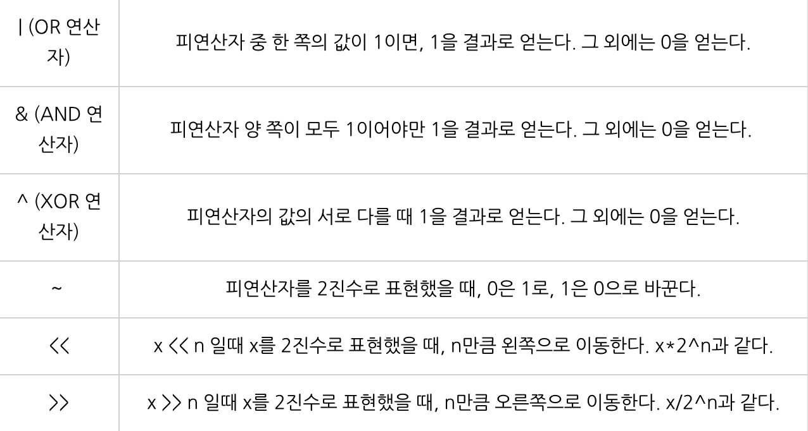
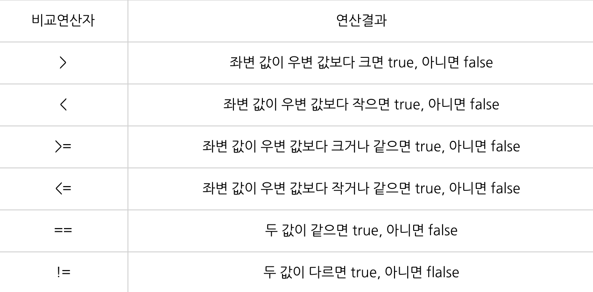
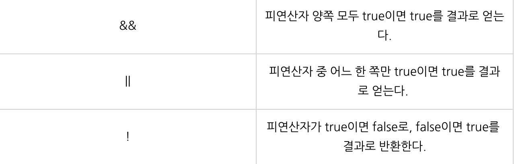
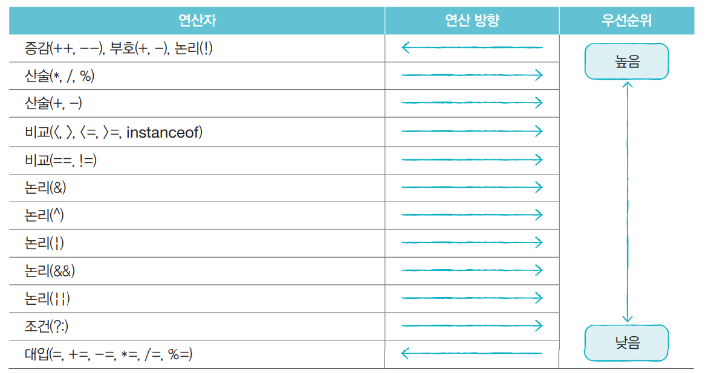

# Week 3 스터디
## 스터디 기간(과제 제출 기간)
24.09.24 ~ 24.10.08

## 스터디 주제
### README 스터디 내용 정리 세부 주제
- 산술 연산자 / 비트 연산자 / 관계 연산자 / 논리 연산자
1. 산술 연산자
  산술 연산자에는 사칙연산자(+,-,*,/)와 나머지 연산자(%)가 있다
  곱셈(*), 나눗셈(/), 나머지(%) 연산자가 덧셈(+), 뺄셈(-) 연산자보다 우선순위가 높다
  피연산자가 정수인 경우 나누는 수로 0을 사용할 수 없으며 0으로 나눌경우 에러가 난다 (ArithmeticException)
  또한, 나누기 연산자의 두 피연산자가 정수일 경우 결과도 정수로 나오기 때문에 올바른 결과를 얻기 위해선 두 피연산자 중 하나를 형변환해줘야 한다.
2. 비트 연산자
   
   비트 연산자는 피연산자를 비트단위로 논리 연산한다.
3. 관계 연산자
   
   주로 조건문과 반복문에 사용되고 연산결과는 오직 true 와 false 둘 중 하나이다
   피연산자의 타입이 다를 경우 자료형의 범위가 더 큰 쪽으로 타입을 일치시킨후 비교한다
   두 문자열을 비교할 때는 비교 연산자 '==' 대신 equals() 메서드 사용

4. 논리 연산자
   
   논리연산자는 둘 이상의 조건을 and 또는 or로 연셜하여 하나의 식으로 표현할 수 있다
   
- instanceof
instanceof의 왼쪽애는 참조변수를, 오른쪽에는 타입이 피연산자로 위치한다
주로 조건문에 사용하며 연산의 결과로 true나 false를 반환한다.
만약 instanceof 연산의 결과가 true라면 검사한 타입으로 형변환이 가능하다

- assignment(=) operator
대입 연산자(assignment operator)는 변수와 같은 저장공간에 값 또는 수식의 연산결과를 저장
-> 대입연산자는 연산자들 중에서 우선순위가 가장 낮기 때문에 가장 나중에 수행된다

- 화살표(->) 연산자
화살표 연산자는 람다식에서 사용하는데 람다식은 메서드의 이름과 반환값이 없어진다

ex)
int max(int a, int b){
  return a>b?a:b;
}

(a,b) -> a>b?a:b
위와 같이 나타낸다

- 3항 연산자
조건식, 식1, 식2 모두 세개의 피연산자를 필요로 하는 조건 연산자이다

max=(x>y)?x:y; // (x>y)가 true일 때 max=x, false일 때 max=y이다

- 연산자 우선 순위

### 실습 내용
3주차는 쉬셔도 됩니다.😊

## 과제 완료 인원
|이름|닉네임|확인✔|
|---|------|----|
|김민우|[M1nu0x0](https://github.com/M1nu0x0)|✔|
|김서윤|[TomnJelly](https://github.com/TomnJelly)||
|배현진|[hyunjin809](https://github.com/hyunjin809)||

## 3주차 발표자
**[발표자](https://github.com/발표자)**
