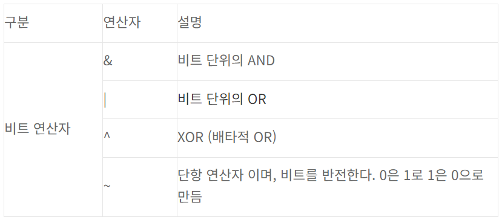
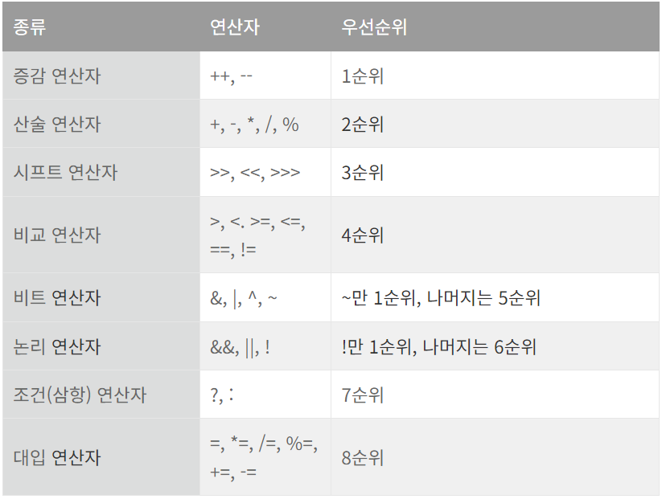

# Week 3 스터디

## 산술 연산자 / 비트 연산자 / 관계 연산자 / 논리 연산자
연산자(operator)   
프로그램에서 데이터를 처리하여 결과를 산출하는 것을 연산(operation)이라 한다. 연산에 사용되는 표시나 기호를 연산자(operator)라고 한다. 연산되는 데이터는 피연산자(operand)라고 한다.

산술 연산자    
가장 기본이 되는 연산자로 4칙 연산(+, -, *, /)과 나머지 값을 구하는 나머지 연산자(%)가 있다. 나머지 연산자의 결과값은 나머지 값을 반환하기 때문에 결과값이 회귀하게 된다.

비트 연산자  
피연산자 즉 연산의 대상이 되는 값들을 내부적으로 bit단위로 변경한 후 연산을 수행하는 연산자이다.   
   

관계 연산자   
변수나 상수의 값을 비교할 때 쓰이는 연산자로서 결과가 항상 true 또는 false인 논리값(boolean)이어야 한다.   

논리 연산자   
논리 연산자는 피연산자의 값이 true나 false인 논리 값을 가지고 다시 한번 조건 연산하는 연산자이다.   
   

## instanceof
instanceof, 객체 타입 확인은 객체 타입을 확인하는 연산자이다. 형변환 가능 여부를 확인하며 true / false로 결과를 반환한다. 주로 상속 관계에서 부모객체인지 자식 객체인지 확인하는 데 사용된다. instanceof의 기본 사용방법은 "객체 instanceof 클래스" 를 선언함으로써 사용한다. 

    class Parent{}   
    class Child extends Parent{}

    public class InstanceofTest {

        public static void main(String[] args){

            Parent parent = new Parent();
            Child child = new Child();

            System.out.println( parent instanceof Parent );  // true
            System.out.println( child instanceof Parent );   // true
            System.out.println( parent instanceof Child );   // false
            System.out.println( child instanceof Child );   // true
        }
    }
모든 클래스는 Object를 상속하기 때문에 Object Instanceof Object 는 항상 true라는 값이 나온다. null에 대한 instanceof 값은 false이다.
## assignment(=) operator
assignment operator, 대입 연산자는 변수에 값을 대입하는 것을 목적으로 사용된다. 변수의 값에 대입할 값을 오른쪽에 작성하고, 변수의 이름을 왼쪽에 작성한다. 주의할 점은 변수를 선언하고 값을 할당하여야 한다는 것과 값을 덮어씌우기 때문에 기존의 값을 유지해야 한다면 새로운 변수를 선언하는 편이 낫고, 변수의 자료형을 명확하게 지정해야 한다는 것이다.   
![대입연산자][def]
 
## 화살표(->) 연산자
화살표 연산자, 시프트(shift) 연산자는 bit단위의 연산처리를 하며 자료의 가공을 위해 오른쪽 또는 왼쪽으로 이동하여 값에 대한 변화를 일으키는 연산자이다.

## 3항 연산자
조건 연산자(conditional operator)의 한 종류로, if-then-else 조건문과 같은 연산을 수행한다. 사용하는 이유는 부작용없이 코드의 간결성을 높일 수 있기 때문이다. 피연산자가 3개라 해서 삼항 연산자라고 부른다.

## 연산자 우선 순위
연산자 계산 순서   
왼쪽에서 오른쪽 순으로 계산하되, 우선순위가 있는 경우 우선 순위 연산 먼저 실행한다. 보통 연산 순서는 거듭 제곱 - 곱셈 or 나눗셈 - 덧셈 or 뺄셈으로 진행된다.괄호를 쳐줄 경우 괄호 안의 연산을 먼저 시작한다.

연산자의 종류와 우선순위   

## 참고 문헌 및 출처
[[Java] 자바 연산자 (Java Operator)](https://phantom.tistory.com/19)
[[JAVA] 자바_instanceof (객체타입 확인)](https://mine-it-record.tistory.com/120)
[[ JAVA ] Instanceof 연산자란? Instanceof 연산자 사용방법](https://dev-cini.tistory.com/62)
[C/C++] 대입 연산자(assignment operator)를 사용하는 방법
[[C/C++] 대입 연산자(assignment operator)를 사용하는 방법](https://blog.naver.com/netrance/110081960345)
[초보 자바 프로그래밍(13) - 대입연산자(Assignment Operators)](https://moneylogging.tistory.com/entry/%EC%9E%90%EB%B0%94-%EB%8C%80%EC%9E%85%EC%97%B0%EC%82%B0%EC%9E%90)
[[Java] 자바 삼항 연산자 사용법 & 예제 (ternary operator)](https://velog.io/@kai6666/Java-%EC%9E%90%EB%B0%94-%EC%82%BC%ED%95%AD-%EC%97%B0%EC%82%B0%EC%9E%90-%EC%82%AC%EC%9A%A9%EB%B2%95-%EC%98%88%EC%A0%9C-ternary-operator)

[def]: ./assets/assignment_operator.png