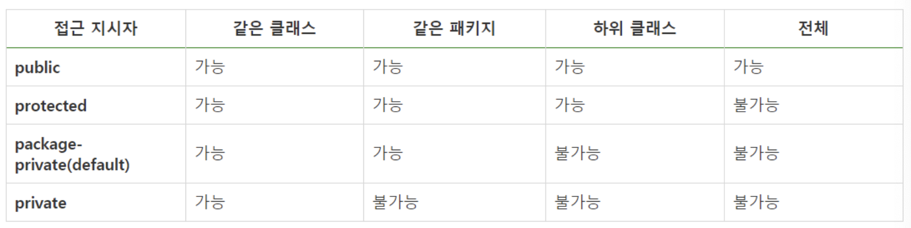

# Week 7 스터디
## 스터디 기간(과제 제출 기간)
24.11.05 ~ 24.11.19

## 스터디 주제
### README 스터디 내용 정리 세부 주제
## package 키워드
: 패키지는 사용자가 만든 클래스나 인터페이스 등을 모은 단위를 말한다.
* 모든 클래스는 정의된 클래스 이름과 패키지 이름이 있다. 
* 패키지는 클래스를 구분짓는 폴더 개념으로, 패키지 이름과 위치한 폴더의 이름이 같아야 한다.
* 패키지 이름은 모두 소문자여야 하고, 자바의 예약어를 사용하면 안된다. 

## import 키워드
: 다른 패키지에 있는 클래스나 인터페이스 등을 참조할 때 사용하는 키워드이다.
* 동일 패키지의 클래스나 java.lang 패키지의 클래스는 import 구문 없이 참조가 가능하다.
* 패키지에 다수의 클래스를 import 하는 경우 import 패키지명.*으로 모든 클래스를 참조할 수 있다.

## 클래스패스
: 자바가 클래스를 사용하려고 탐색을 할 때 JVM 또는 자바 컴파일러가 사용하는 파라미터로 클래스나 패키지를 찾을 때 기준이 되는 경로를 말한다.

* 소스 코드(.java)를 컴파일 하면 바이트 코드(.class)로 변환되고,
  JVM이 바이트 코드로 된 파일을 실행하기 위해 경로를 찾는데, 이 경로를 클래스패스라고 한다.
  
      .java 파일 ----> Compile ----> .class 파일

      
## CLASSPATH 환경변수
: 환경변수는 운영체제에서 자식 프로세스들을 생성할 때 참조하는 변수로 프로세스가 컴퓨터에서 동작하는 방식에 영향을 미치는 동적인 값들을 모아둔 것이다. 

* 이 값을 지정하면 실행할 때마다 -classpath 옵션을 사용하지 않아도 되지만 운영체제를 변경하면 클래스패스가 유지되지 않고 사리지기 때문에 이식성 측면에서 좋지 않다.
  -> 컴파일된 바이트 코드를 클래스로더가 클래스 로딩 단계에서 CLASSPATH라는 환경변수에 있는 경로들을 참조하여 로딩을 한다. 

## -classpath 옵션
  
      javac <options> <source files>  // 컴파일시 파일 경로 지정 옵션
      // java(런타임)과 javac(컴파일타임) 명령어에 모두 사용할 수 있다.
    
## 접근지시자
: 클래스, 필드, 메서드 단위로 외부에서 접근 가능한 범위를 설정하는 것을 말한다.

### 접근 지시자의 기능
  + 객체 생성을 막기 위해 생성자를 호출하지 못하게 함
  + 객체의 특정 데이터를 보호하기 위해 해당 필드에 접근하지 못하게 함
  + 특정 메서드를 호출할 수 없도록 제한하는 기능을 함
  + 
### 접근 지시자 종류
  + public : 모든 패키지에서 아무런 제한 없이 호출할 수 있다.
  + protected : default 접근 제한과 마찬가지로 같은 패키지에 속하는 클래스에서 호출할 수 있도록 한다. 다른 패키지에 속한 클래스가 해당 클래스의 하위 클래스면 호출할 수 있다.
  + package-private : 접근 제한자를 명시하지 않았다면 default 접근 제한을 가진다. 같은 패키지에서는 제한 없이 호출 가능하지만, 다른 패키지에서는 불가능하다.
  + private : 클래스 내부에서만 사용할 수 있다.
  

참고자료
1. https://beststar-1.tistory.com/17
2. https://codingwell.tistory.com/72
3. https://beststar-1.tistory.com/18

### 실습 내용
7주차는 쉬셔도 됩니다.😊

## 과제 완료 인원
|이름|닉네임|확인✔|
|---|------|----|
|김민우|[M1nu0x0](https://github.com/M1nu0x0)|✔|
|김서윤|[TomnJelly](https://github.com/TomnJelly)||
|배현진|[hyunjin809](https://github.com/hyunjin809)||

## 7주차 발표자
**[발표자](https://github.com/발표자)**
