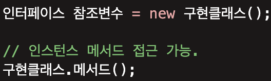
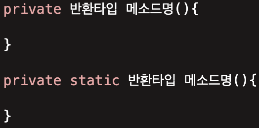

# Week 8 스터디
## 스터디 기간(과제 제출 기간)
24.11.05 ~ 24.11.19

## 스터디 주제
### README 스터디 내용 정리 세부 주제
## interface 정의하는 방법
* 인터페이스는 .java 형태의 소스 파일로 작성되고 컴파일러를 통해 .class 형태로 컴파일되기 때문에 물리적 형태는 클래스와 동일하다. 
    * interface 인터페이스이름{...}
* 여기서 인터페이스이름은 첫문자를 대문자로 하고 나머지는 소문자로 작성한다.

## interface 구현하는 방법
* 인터페이스 구현을 위해 자신의 객체가 인터페이스 타입으로 사용할 수 있음을 implements 키워드로 명시
    * public class 구현클래스명 implements 인터페이스명{}

## interface 레퍼런스를 통해 구현체를 사용하는 방법
* 인터페이스 타입의 참조 변수를 선언하여 인터페이스를 구현한 클래스의 인스턴스를 참조하는 것이 가능
* 단 이와 같이 인터페이스 타입의 참조 변수를 사용해서 클래스에 접글 할때는 클래스에 인터페이스에 없는 메서드는 사용 X
 

## interface 상속
* 인터페이스도 상속이 가능하지만 인터페이스는 인터페이스로부터만 상속받을 수 있습니다.
* 단, 인터페이스는 클래스의 Object 클래스와 같은 최고 조상은 없고, 다중 상속이 가능합니다. 

## interface Default Method (Java 8)
* 인터페이스는 추상메서드만을 선언할 수 있었지만 자바8 부터 Default 메소드, static 메소드 를 추가 할 수 있게 되었습니다. 
* 그중 Default 메소드는 추상 메서드의 기본적인 구현을 제공하는 메서드입니다. 
* 추상메서드가 아니기 때문에 Default 메소드가 새로 추가되어도 해당 인터페이스를 구현한 클래스를 변경하지 않아도 됩니다. 
* 사용방법 : default 반환타입 메소드명(){}

## interface static method (Java 8)
* 인터페이스의 static 메소드성질은 일반 클래스에서 사용하는 static메소드와 동일합니다. 
* Default 메소드와 다르게 static 메소드는 구현하는 클래스에서는 인터페이스의 static 메소드를 변경하는 것이 불가능합니다. 
* 해당 메소드는 일반클래스에서 사용한 것과 같이 인스턴스의 생성없이 '참조변수명.메소드()'를 통해서 접근이 가능합니다.
* 사용방법 : static 반환타입 메소드명(){}
  
## interface private method (Java 9)
* 자바9 에서 추가적으로 private method와 private static method를 사용 할 수 있게 되었습니다. 
* 해당 기능을 통해서 다른 인터페이스, 클래스가 숨기길 원하는 메소드에 대한 접근을 막을 수가 있게 되었습니다. 
* private method는 해당 메소드를 가진 인터페이스 내의 메소드들만 호출이 가능하다.

 

### 실습 내용
**WARNING: GPT 안돼요!!**

6주차에 배웠던 Dynamic Method Dispatch 구현해봅시다.

다음과 같이 `Payment`를 상속하여 결제 수단을 만든 뒤 이에 대해서 사용하는 예제를 작성해주시면 됩니다.
``` java
package payment;

public interface Payment {
    boolean pay(double price);
}
```
```java
package payment;

public class CreditCard implements Payment {
    @Override
    public boolean pay(double price) {
        System.out.println("You paid by Credit Card");
        return true
    }
}
```
참고자료
1. https://velog.io/@tjswjd031/%EC%9D%B8%ED%84%B0%ED%8E%98%EC%9D%B4%EC%8A%A4%EC%9D%98-%EC%97%AD%ED%95%A0%EA%B3%BC-%EC%84%A0%EC%96%B8
2. https://skorea6.tistory.com/entry/%EC%9E%90%EB%B0%94-%EC%9D%B8%ED%84%B0%ED%8E%98%EC%9D%B4%EC%8A%A4-%EC%9D%98%EB%AF%B8-%EA%B5%AC%ED%98%84-%EB%B0%A9%EB%B2%95-interface
3. https://kimvampa.tistory.com/125
## 과제 완료 인원
|이름|닉네임|확인✔|
|---|------|----|
|김민우|[M1nu0x0](https://github.com/M1nu0x0)|✔|
|김서윤|[TomnJelly](https://github.com/TomnJelly)||
|배현진|[hyunjin809](https://github.com/hyunjin809)||

## 8주차 발표자
**[발표자](https://github.com/발표자)**
