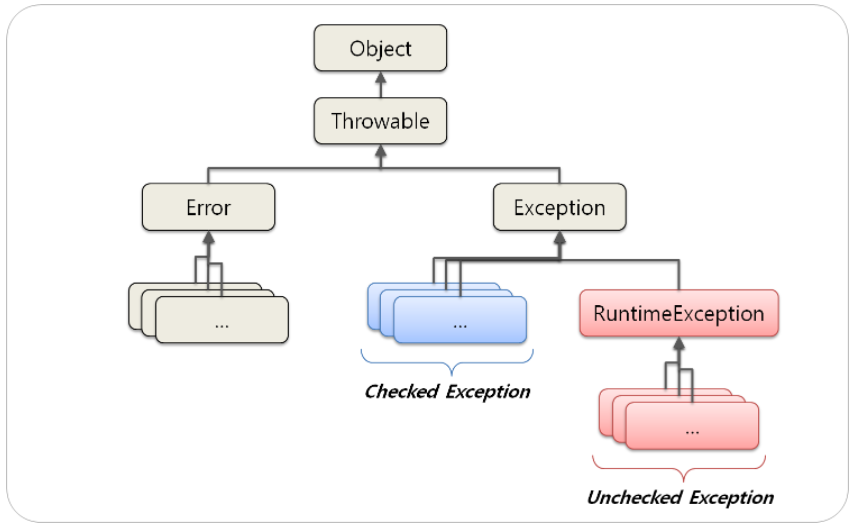

# Week 9 스터디
## 스터디 기간(과제 제출 기간)
24.11.19 ~ 24.12.03

## 스터디 주제
### README 스터디 내용 정리 세부 주제

### 예외처리 (try, catch, throw, throws, finally)
try-catch 문
```
try{
    예외가 생길 가능성이 있는 코드 작성
}catch(예외발생 클래스명 e){
    예외처리 코드
}
```
하지만 예외가 발생했던, 또는 안했던 어떤 소스코드를 실행하고 싶을 때 추가적으로 finally를 사용합니다.

```
try{
    예외가 생길 가능성이 있는 코드 작성
}catch(예외발생 클래스명 e){
    예외처리 코드
}finally{
    실행되어야할 코드
}
```
throw는 보통 개발자가 직접 사용자정의 예외를 발생시키고 싶을 때 사용합니다.
```
public class Main {

	public static void throwExample() throws Exception {
		throw new Exception();
	}
	public static void main(String[] args) {
		try {
			throwExample();
		} catch (Exception e){
			System.out.println("예외가 발생했습니다...");
		}
	}
}
```
사용자가 직접 예외를 발생시켜주고싶은 부분에 throw new Excepiton();을 통하여 예외를 발생시켜주고 throws를 통하여 예외처리를 던져줍니다.

throws
```
public class Main {

	public static void nanum(int a, int b) throws ArithmeticException {
		System.out.println(a/b);
	}
	public static void main(String[] args) {
		int num1, num2;
		num1 = 10;
		num2 = 0;
		
		try {
			nanum(num1,num2);
		} catch (ArithmeticException e){
			System.out.println("0으로 나눌 수는 없어요..");
		}
	}
}
```
메소드 뒤에 throws ArithmethicException을 사용하는 것을 확인할 수 있고 만약 이 예외가 발생했을 때 이 메소드를 사용하는 곳에서 예외처리를 넘겨주도록 하는 것입니다. 
try-catch를 사용하지 않고 throws를 사용하는 이유로는 한가지 예외 상황에 대해서 각자 다른 방법으로 예외처리를 하고 싶을 때 사용합니다.

### 예외 계층 구조

 
 모든 예외 클래스는 Throwable 클래스를 상속받는다. 

 Throwable을 상속받은 클래스는 Error와 Exception이 있는데, 개발로직은 Exception에 대한 것만 처리하면 됩니다. 

Exception은 수많은 자식 클래스들이 있는데, 이때 CompileException(Checked Exception)과 RuntimeException(Unchecked Exception)을 구분할 필요가 있다고 합니다. 

### Exception과 Error의 차이

오류(Error)는 시스템적으로 비정상적인 상황이 생겼을 때 발생한다. 이는 시스템 레벨에서 발생한고, 개발자가 미리 예측하여 처리할 수 없기 때문에 오류에 대한 처리는 신경쓰지 않는다.

이와 다르게 예외(Exception)은 반대로 비정상적인 상황을 예측하여 처리하는 것이다. 개발자는 자신이 구현한 로직에서 예외를 예측하고 그에 따른 예외처리를 신경써야 한다. 

### RuntimeException과 RE가 아닌 것의 차이

위에 나왔던 예외 계층 구조에도 남아있듯이, exception은 unchecked exception과 checked exception으로 나뉘는데, Unchecked Exception은 이름 그대로 미리 검사하지 않는 예외로 Runtime Exception입니다. 이는 Error도 포함하는데, 에러 역시 컴파일 단계에서 알 수 없습니다. Unchecked Exception도 마찬가지로, 컴파일 단계에서는 알 수 없고, 직접 실행하는 시점에 알 수 있는 문제를 처리하는 객체들입니다. 

Checked Exception은 unchecked exception과 반대로, 컴파일 단계에서 비정상적인 상황을 처리하는 방식입니다. RuntimeException과는 반대인 것입니다. 따라서 컴파일 시점에 문제를 처리하기 때문에 반드시 명시적으로 이 문제를 처리하는 코드를 추가해야합니다. 


### 커스텀한 예외 만드는 방법
일반 예외로 선언할 경우 Exception을 상속받아 구현
실행 예외로 선언할 경우에는 RuntimeException을 상속받아 구현

+ 사용자 정의 예외 클래스 이름은 Exception으로 끝나는 것을 권장합니다.
+ 사용자 정의 예외 클래스 작성 시 생성자는 두 개를 선언하는 것이 일반적입니다.
매개 변수가 없는 기본 생성자 + 예외 발생 원인(예외 메시지)을 전달하기 위해 String 타입의 매개변수를 갖는 생성자
+ 예외 메시지의 용도는 catch {} 블록의 예외처리 코드에서 이용하기 위해서입니다.

```
public static void main(String[] args) {
    try{
        test();
    } catch (CustomException e) {
        System.out.println("커스텀 예외 테스트");
    }
}

public static void test() throws CustomException {
    throw new CustomException("예외 테스트 입니다.");
}
```

참고자료
1. https://velog.io/@mooh2jj/%EC%9E%90%EB%B0%94-%EC%98%88%EC%99%B8%EC%B2%98%EB%A6%ACtry-catch-throw-throws
2. https://sundrystore.tistory.com/14
3. https://veneas.tistory.com/entry/Java-%EC%BB%A4%EC%8A%A4%ED%85%80-%EC%98%88%EC%99%B8-%EB%A7%8C%EB%93%A4%EA%B8%B0Custom-Exception

### 실습 내용
**WARNING: GPT 안돼요!!**

사용자로부터 두 숫자를 입력받고, 이에 대한 나눗셈 연산 시의 예외 처리를 해봅시다.

```java
import java.util.Scanner;

public class ExceptionTest {
    public static void main(String[] args) throws Exception {
        Scanner scanner = new Scanner(System.in);
        // Your code here.
        scanner.close();
    }
}
```

## 과제 완료 인원
|이름|닉네임|확인✔|
|---|------|----|
|김민우|[M1nu0x0](https://github.com/M1nu0x0)|✔|
|김서윤|[TomnJelly](https://github.com/TomnJelly)||
|배현진|[hyunjin809](https://github.com/hyunjin809)||

## 9주차 발표자
**[발표자](https://github.com/발표자)**
